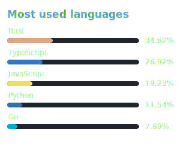
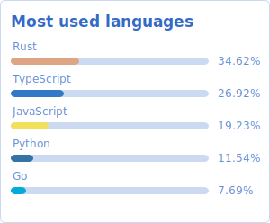

# How to add new themes?

If you want to contribute a new theme, please add a new CSS file in the `assets/css/themes` directory. The file name should be in kebab-case (e.g., `new-theme.css`). The macro will automatically generate the necessary Rust code for the new theme based on the file name.

The CSS classes defined in the theme file should follow the naming convention used in the existing themes.

> [!NOTE]  
> While you can use CSS for styling, keep in mind that you are working with SVG elements. This means that some CSS properties may not work as expected.

The **Transparent** column shows theme variants with `hide_background=true` and `hide_background_stroke=true` options enabled, removing the card background for integration into custom layouts.

## Stats Card

| Theme | Default | Transparent |
|-------|---------|-------------|
| `dark` |  |  |
| `light` |  |  |
| `monokai` |  |  |
| `transparent_blue` |  |  |

## Langs Card

| Theme | Default | Transparent |
|-------|---------|-------------|
| `dark` |  |  |
| `light` |  |  |
| `monokai` |  |  |
| `transparent_blue` |  |  |
